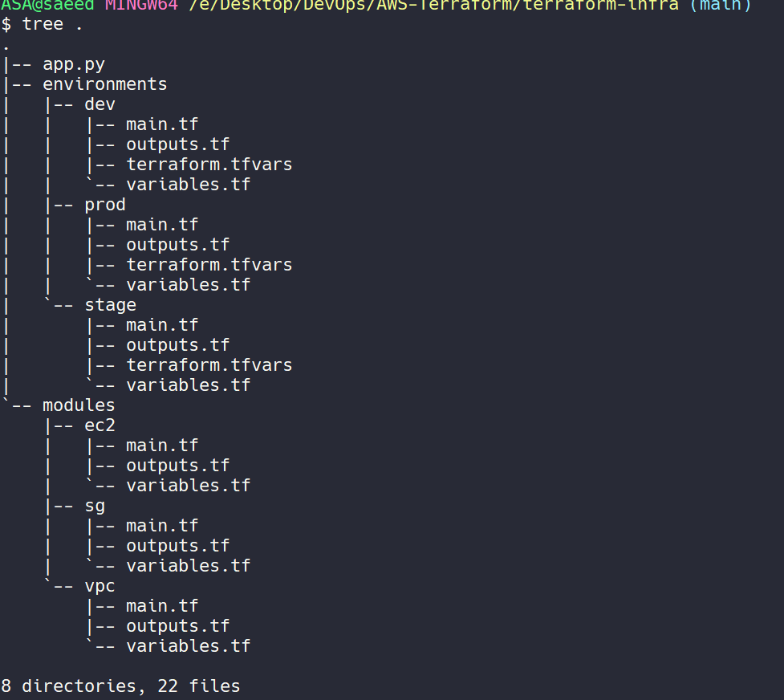

# Python-Script-to-Create-Terraform-Modules-Structure

## Why Modular Approach to create Resources???
`***Reusability:***` 
Modularization allows you to create reusable components that can be used across multiple projects or environments. This saves time and effort by avoiding duplicating code and configurations.

`***Scalability:***` 
Modular designs are easier to scale. You can scale your infrastructure horizontally by adding more instances of the same module, or vertically by extending existing modules with additional features.

`***Maintainability:***` 
Breaking down your infrastructure into smaller, manageable modules makes it easier to understand, update, and maintain over time. Each module can focus on a specific aspect of your infrastructure, reducing complexity and making troubleshooting easier.

`***Flexibility:***` 
Modular designs provide flexibility in composing infrastructure. You can mix and match modules to meet specific requirements, making it easier to adapt to changes in business needs or technology requirements.

`***Collaboration:***` 
Modular designs promote collaboration among teams. Different teams can work on separate modules independently without interfering with each other's work. This fosters better collaboration and improves productivity.

`***Testing:***`
Modular designs facilitate testing at a granular level. You can test individual modules in isolation, ensuring that each component works as expected before integrating it into the larger infrastructure.

`***Versioning:***` 
Modular designs allow for versioning of infrastructure components. Each module can have its own version control, enabling better tracking of changes and easier rollback if needed.

Overall, the modular approach in Terraform promotes best practices in software development, such as reusability, maintainability, and scalability, while providing flexibility and enabling collaboration among teams.
